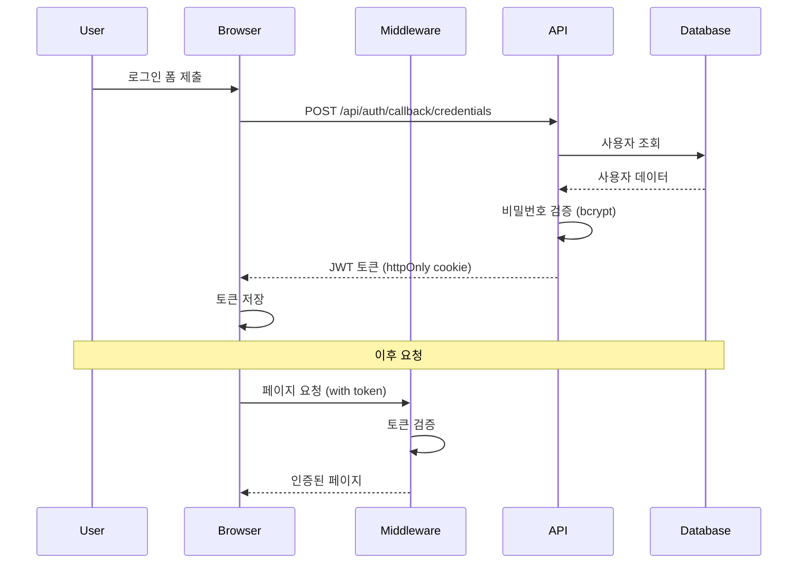
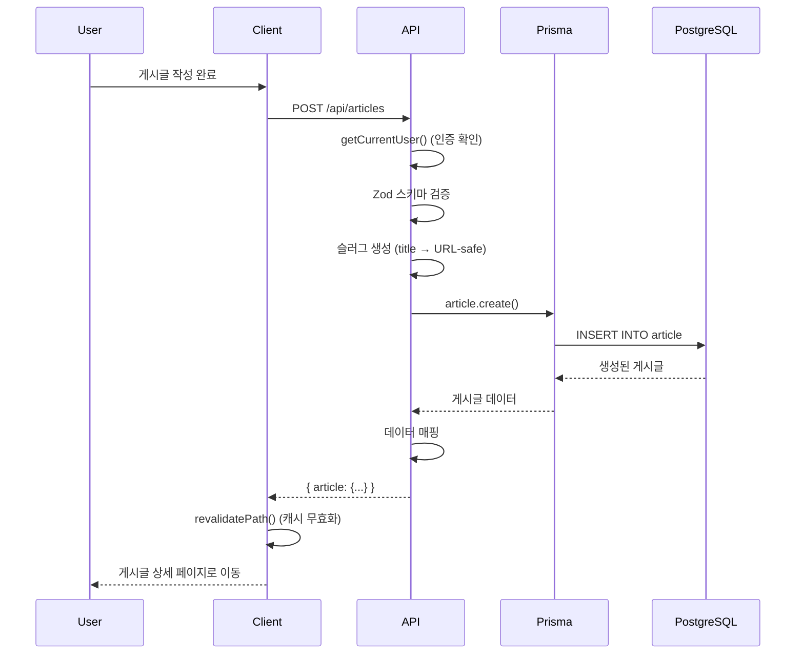
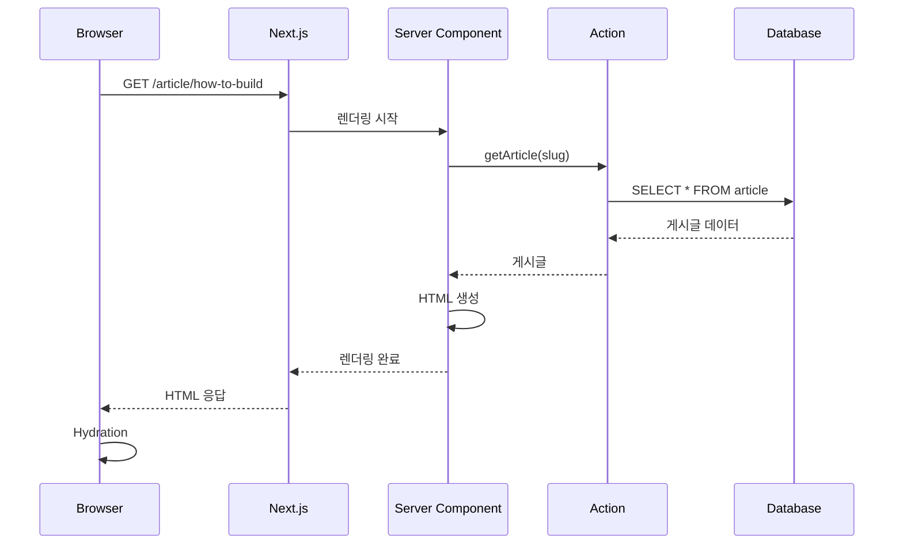
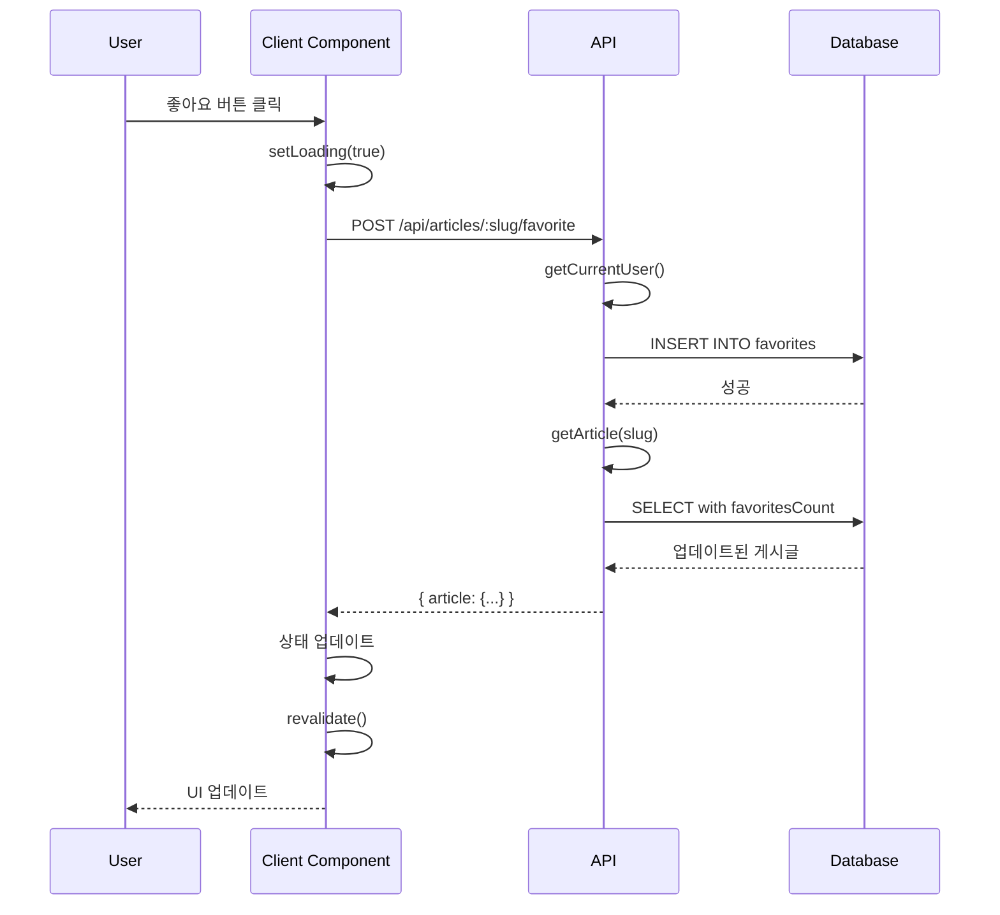

# 프로젝트 아키텍처

> **작성일**: 2026-03-11
> **목적**: Next.js 14 App Router 아키텍처 문서화

## 목차

1. [개요](#개요)
2. [기술 스택](#기술-스택)
3. [프로젝트 구조](#프로젝트-구조)
4. [아키텍처 패턴](#아키텍처-패턴)
5. [핵심 설계 결정](#핵심-설계-결정)
6. [데이터 흐름](#데이터-흐름)
7. [보안 고려사항](#보안-고려사항)

---

## 개요

이 프로젝트는 **Next.js 14 App Router**를 활용한 풀스택 소셜 블로깅 플랫폼입니다. RealWorld 스펙을 구현하며, 서버 컴포넌트, 라우트 핸들러, 미들웨어를 활용한 현대적인 웹 애플리케이션 아키텍처를 보여줍니다.

### 핵심 특징

- **Next.js 14 App Router**: 서버/클라이언트 컴포넌트 분리 전략
- **타입 안정성**: TypeScript + Zod 스키마 검증
- **인증**: NextAuth.js 기반 JWT 인증
- **데이터베이스**: Prisma ORM + PostgreSQL
- **국제화**: next-intl을 활용한 다국어 지원
- **스타일링**: Tailwind CSS

---

## 기술 스택

### 프레임워크 & 라이브러리

```yaml
frontend:
  framework: "Next.js 14.0.3"
  ui_library: "React 18"
  language: "TypeScript 5"
  styling: "Tailwind CSS 3.3"
  i18n: "next-intl 3.4"

backend:
  runtime: "Node.js (Next.js API Routes)"
  orm: "Prisma 5.6"
  database: "PostgreSQL"
  auth: "NextAuth.js 4.24"
  validation: "Zod 3.22"

tooling:
  linting: "ESLint 8"
  formatting: "Prettier 3.1"
  package_manager: "npm"
```

### 주요 의존성

| 패키지 | 버전 | 용도 |
|--------|------|------|
| next | 14.0.3 | 프레임워크 |
| react | 18 | UI 라이브러리 |
| @prisma/client | 5.6.0 | ORM 클라이언트 |
| next-auth | 4.24.5 | 인증 |
| next-intl | 3.4.1 | 국제화 |
| zod | 3.22.4 | 스키마 검증 |
| bcrypt | 5.1.1 | 비밀번호 해싱 |
| marked | 11.0.0 | Markdown 렌더링 |
| slug | 8.2.3 | URL 슬러그 생성 |

---

## 프로젝트 구조

### 디렉토리 구조

```
next-fullstack-realworld-app/
├── prisma/                    # Prisma 스키마 및 마이그레이션
│   ├── schema.prisma         # 데이터베이스 스키마
│   └── seed.ts               # 시드 데이터
│
├── src/
│   ├── actions/              # Server Actions (데이터 페칭)
│   │   ├── getArticle.ts
│   │   ├── getArticles.ts
│   │   ├── getComments.ts
│   │   ├── getCurrentUser.ts
│   │   └── getUserProfile.ts
│   │
│   ├── app/                  # Next.js App Router
│   │   ├── (browse)/         # 브라우징 레이아웃 그룹
│   │   │   └── [locale]/     # 로케일별 라우트
│   │   │       ├── (home)/   # 홈 페이지
│   │   │       ├── article/  # 게시글 상세
│   │   │       ├── editor/   # 게시글 에디터
│   │   │       ├── login/    # 로그인
│   │   │       ├── register/ # 회원가입
│   │   │       ├── profile/  # 프로필
│   │   │       └── settings/ # 설정
│   │   │
│   │   ├── api/              # API 라우트 핸들러
│   │   │   ├── articles/
│   │   │   │   ├── route.ts              # POST /api/articles
│   │   │   │   └── [slug]/
│   │   │   │       ├── route.ts          # PUT, DELETE /api/articles/:slug
│   │   │   │       ├── comments/
│   │   │   │       │   ├── route.ts      # GET, POST /api/articles/:slug/comments
│   │   │   │       │   └── [commentId]/
│   │   │   │       │       └── route.ts  # DELETE /api/articles/:slug/comments/:id
│   │   │   │       └── favorite/
│   │   │   │           └── route.ts      # POST, DELETE /api/articles/:slug/favorite
│   │   │   ├── auth/
│   │   │   │   └── [...nextauth]/
│   │   │   │       └── route.ts          # NextAuth 핸들러
│   │   │   ├── profiles/
│   │   │   │   └── [username]/
│   │   │   │       └── follow/
│   │   │   │           └── route.ts      # POST, DELETE /api/profiles/:username/follow
│   │   │   ├── user/
│   │   │   │   └── route.ts              # PUT /api/user
│   │   │   ├── users/
│   │   │   │   └── route.ts              # POST /api/users
│   │   │   ├── mapper.ts                 # 데이터 매퍼
│   │   │   └── response.ts               # API 응답 유틸
│   │   │
│   │   └── layout.tsx        # 루트 레이아웃
│   │
│   ├── components/           # React 컴포넌트
│   │   ├── article/          # 게시글 관련 컴포넌트
│   │   ├── common/           # 공통 컴포넌트
│   │   ├── editor/           # 에디터 컴포넌트
│   │   ├── footer/           # 푸터
│   │   ├── header/           # 헤더
│   │   ├── popular-tags/     # 인기 태그
│   │   ├── profile/          # 프로필
│   │   └── user/             # 사용자 관련
│   │
│   ├── libs/                 # 라이브러리 설정
│   │   ├── auth.ts           # NextAuth 설정
│   │   └── prisma.ts         # Prisma 클라이언트
│   │
│   ├── middlewares/          # 미들웨어 체인
│   │   ├── chain.ts          # 미들웨어 체이닝 유틸
│   │   ├── withAuth.ts       # 인증 미들웨어
│   │   ├── withFeed.ts       # 피드 미들웨어
│   │   └── withIntl.ts       # 국제화 미들웨어
│   │
│   ├── types/                # TypeScript 타입 정의
│   │   └── response.ts       # API 응답 타입
│   │
│   ├── utils/                # 유틸리티 함수
│   │   ├── constants.ts      # 상수
│   │   ├── dateTime.ts       # 날짜/시간 유틸
│   │   └── fetch.ts          # Fetch 래퍼
│   │
│   ├── validation/           # Zod 스키마
│   │   └── schema.ts         # 입력 검증 스키마
│   │
│   ├── i18n.ts               # i18n 설정
│   ├── middleware.ts         # 글로벌 미들웨어
│   └── navigation.ts         # 네비게이션 유틸
│
├── docs/                     # 문서
│   ├── ARCHITECTURE.md       # 아키텍처 문서 (이 파일)
│   ├── openapi.yaml          # OpenAPI 스펙
│   ├── PROJECT_REQUIREMENTS.md
│   └── INTERVIEW_RESULTS.md
│
├── docker-compose.yml        # 개발 환경 설정
├── next.config.js            # Next.js 설정
├── tailwind.config.ts        # Tailwind 설정
└── tsconfig.json             # TypeScript 설정
```

### 라우트 구조

#### 페이지 라우트 (App Router)

```
/[locale]                    → 홈 (게시글 목록)
/[locale]/article/:slug      → 게시글 상세
/[locale]/editor             → 새 게시글 작성
/[locale]/editor/:slug       → 게시글 수정
/[locale]/login              → 로그인
/[locale]/register           → 회원가입
/[locale]/profile/:username  → 사용자 프로필
/[locale]/settings           → 사용자 설정
```

#### API 라우트

API 문서는 [OpenAPI 스펙](./openapi.yaml)을 참조하세요.

---

## 아키텍처 패턴

### 1. Next.js 14 App Router 패턴

#### 서버 컴포넌트 (기본)

```typescript
// src/app/(browse)/[locale]/(home)/page.tsx
export default async function HomePage() {
  // 서버에서 데이터 페칭
  const articles = await getArticles()

  return <ArticleList articles={articles} />
}
```

**장점**:
- 초기 로딩 속도 향상
- SEO 최적화
- 데이터베이스 직접 접근 가능

#### 클라이언트 컴포넌트

```typescript
// src/components/common/FavoriteButton.tsx
'use client'

export function FavoriteButton() {
  const [favorited, setFavorited] = useState(false)

  // 클라이언트 상호작용
  const handleFavorite = async () => {
    await fetch('/api/articles/slug/favorite', { method: 'POST' })
    setFavorited(true)
  }

  return <button onClick={handleFavorite}>...</button>
}
```

**사용 시나리오**:
- 사용자 상호작용 (클릭, 폼 입력)
- useState, useEffect 등 React Hooks 사용
- 브라우저 API 접근 (localStorage, window)

#### 레이아웃 그룹

```
app/
├── (browse)/           # 브라우징 레이아웃
│   └── [locale]/       # 로케일 라우팅
│       └── layout.tsx  # 공통 레이아웃
```

**목적**: URL에 영향을 주지 않고 레이아웃 공유

### 2. API 라우트 핸들러 패턴

#### RESTful 라우트 핸들러

```typescript
// src/app/api/articles/route.ts
export async function POST(req: NextRequest) {
  // 1. 인증 확인
  const currentUser = await getCurrentUser()
  if (!currentUser) {
    return ApiResponse.unauthorized()
  }

  // 2. 입력 검증 (Zod)
  const body = await req.json()
  const result = articleInputSchema.safeParse(body.article)
  if (!result.success) {
    return ApiResponse.badRequest(result.error)
  }

  // 3. 비즈니스 로직
  const article = await prisma.article.create({
    data: { ...result.data }
  })

  // 4. 응답
  return ApiResponse.ok({ article })
}
```

**패턴**:
1. **인증/인가**: getCurrentUser()로 사용자 확인
2. **검증**: Zod 스키마로 입력 검증
3. **비즈니스 로직**: Prisma로 데이터베이스 작업
4. **응답**: 표준화된 ApiResponse 유틸 사용

#### 동적 라우트

```typescript
// src/app/api/articles/[slug]/route.ts
export async function DELETE(
  req: NextRequest,
  { params }: { params: { slug: string } }
) {
  const article = await prisma.article.findUnique({
    where: { slug: params.slug }
  })
  // ...
}
```

### 3. 미들웨어 체이닝 패턴

```typescript
// src/middleware.ts
import { chain } from '@/middlewares/chain'
import { withIntl } from '@/middlewares/withIntl'
import { withAuth } from '@/middlewares/withAuth'
import { withFeed } from '@/middlewares/withFeed'

export default chain([withIntl, withAuth, withFeed])
```

**미들웨어 실행 순서**:
1. **withIntl**: 로케일 감지 및 리다이렉트
2. **withAuth**: 인증 확인 및 보호된 라우트 접근 제어
3. **withFeed**: 피드 필터링 (로그인 사용자의 팔로우 피드)

#### 미들웨어 구현 예시

```typescript
// src/middlewares/withAuth.ts
export function withAuth(middleware: CustomMiddleware): CustomMiddleware {
  return async (request, event) => {
    const token = await getToken({ req: request })

    // 보호된 라우트 확인
    if (isProtectedRoute(request.nextUrl.pathname) && !token) {
      return NextResponse.redirect(new URL('/login', request.url))
    }

    return middleware(request, event)
  }
}
```

### 4. Server Actions 패턴

```typescript
// src/actions/getArticles.ts
export async function getArticles(params?: {
  tag?: string
  author?: string
  favorited?: string
  limit?: number
  offset?: number
}) {
  const articles = await prisma.article.findMany({
    where: {
      // 필터링 로직
    },
    include: {
      author: true,
      tagList: { include: { tag: true } },
      favoritedBy: true,
    },
  })

  return articles
}
```

**용도**:
- 서버 컴포넌트에서 데이터 페칭
- 클라이언트 컴포넌트에서 `'use server'` 지시어로 호출 가능
- API 라우트보다 간결한 데이터 페칭

### 5. 데이터 검증 패턴 (Zod)

```typescript
// src/validation/schema.ts
export const articleInputSchema = z.object({
  title: z.string()
    .trim()
    .min(1, 'Title is required')
    .max(100, 'Title is too long'),
  description: z.string().optional(),
  body: z.string()
    .min(1, 'Body is required')
    .max(65535, 'Body is too long'),
  tagList: z.array(
    z.string().trim().max(100, 'Tag is too long')
  ).optional(),
})
```

**장점**:
- 타입 안정성 (TypeScript 타입 자동 추론)
- 명확한 에러 메시지
- 재사용 가능한 스키마

### 6. 데이터 매핑 패턴

```typescript
// src/app/api/mapper.ts
export function userMapper(user: User, following?: boolean): Profile {
  return {
    id: user.id,
    username: user.username,
    email: user.email,
    bio: user.bio,
    image: user.image || 'https://api.realworld.io/images/smiley-cyrus.jpeg',
    following: following ?? false,
  }
}
```

**목적**:
- 민감한 정보 제거 (password)
- 일관된 API 응답 형식
- 기본값 설정

---

## 핵심 설계 결정

### 1. Next.js 14 App Router 선택

**결정**: App Router 사용 (Pages Router 대신)

**근거**:
- 서버 컴포넌트 기본 지원으로 성능 향상
- 레이아웃 공유 및 중첩 라우팅 개선
- 스트리밍 및 서스펜스 지원
- React Server Components의 장점 활용

**트레이드오프**:
- ✅ 초기 로딩 속도 향상
- ✅ SEO 최적화
- ✅ 번들 크기 감소
- ⚠️ 학습 곡선 (서버/클라이언트 컴포넌트 구분)
- ⚠️ 일부 라이브러리 호환성 문제

### 2. 미들웨어 체이닝

**결정**: 단일 미들웨어 파일에서 여러 미들웨어 체이닝

**근거**:
- Next.js는 하나의 미들웨어 파일만 지원
- 관심사 분리 (인증, i18n, 피드 로직 분리)
- 테스트 및 유지보수 용이

**구현**:
```typescript
// 함수형 체이닝 패턴
export function chain(middlewares: CustomMiddleware[]): Middleware {
  return (request, event) => {
    let response = NextResponse.next()

    for (const middleware of middlewares) {
      response = await middleware(request, event, response)
    }

    return response
  }
}
```

### 3. Prisma ORM

**결정**: Prisma 사용 (TypeORM, Sequelize 대신)

**근거**:
- TypeScript 퍼스트 설계
- 타입 안전한 쿼리
- 마이그레이션 도구 내장
- Prisma Studio (GUI) 제공
- Next.js와 우수한 통합

**스키마 설계**:
```prisma
model User {
  id         String      @id @default(uuid())
  email      String      @unique
  username   String      @unique
  password   String
  bio        String?
  image      String?
  articles   Article[]
  favorites  Favorites[]
  following  Follows[]   @relation("follower")
  followedBy Follows[]   @relation("following")
  comments   Comment[]
}
```

### 4. NextAuth.js 인증

**결정**: NextAuth.js 사용 (Passport.js, Auth0 대신)

**근거**:
- Next.js 공식 추천
- JWT 및 세션 지원
- Prisma Adapter 제공
- 소셜 로그인 확장 용이

**설정**:
```typescript
// src/libs/auth.ts
export const authOptions: NextAuthOptions = {
  adapter: PrismaAdapter(prisma),
  providers: [
    CredentialsProvider({
      // 이메일/비밀번호 로그인
    }),
  ],
  session: { strategy: 'jwt' },
  callbacks: {
    jwt: async ({ token, user }) => { /* ... */ },
    session: async ({ session, token }) => { /* ... */ },
  },
}
```

### 5. 국제화 (i18n)

**결정**: next-intl 사용

**근거**:
- App Router 지원
- 서버/클라이언트 컴포넌트 모두 지원
- 타입 안전한 번역
- 동적 로케일 라우팅

**구현**:
```typescript
// src/i18n.ts
export default getRequestConfig(async ({ locale }) => ({
  messages: (await import(`../messages/${locale}.json`)).default,
}))
```

**라우팅 전략**:
- `/en/*` - 영어
- `/zh/*` - 중국어
- 미들웨어에서 자동 감지 및 리다이렉트

---

## 데이터 흐름

### 1. 인증 흐름



### 2. 게시글 생성 흐름



### 3. 페이지 렌더링 흐름 (서버 컴포넌트)



### 4. 좋아요 기능 흐름 (클라이언트 컴포넌트)



---

## 보안 고려사항

### 1. 인증 및 인가

#### JWT 토큰
- **저장 위치**: httpOnly 쿠키 (XSS 공격 방지)
- **만료 시간**: 설정 가능 (기본 30일)
- **갱신**: 자동 갱신 메커니즘

#### 비밀번호 보안
```typescript
// bcrypt 해싱 (salt rounds: 10)
const hashPassword = await bcrypt.hash(password, 10)
```

#### 라우트 보호
```typescript
// 미들웨어에서 보호된 라우트 확인
const protectedRoutes = ['/editor', '/settings']
if (protectedRoutes.includes(pathname) && !token) {
  return NextResponse.redirect('/login')
}
```

### 2. 입력 검증

#### Zod 스키마 검증
```typescript
const result = schema.safeParse(input)
if (!result.success) {
  return ApiResponse.badRequest(result.error)
}
```

#### SQL 인젝션 방지
- Prisma ORM 사용으로 자동 방지
- 파라미터화된 쿼리 자동 생성

### 3. CSRF 보호

- NextAuth.js 내장 CSRF 토큰
- SameSite 쿠키 설정

### 4. XSS 방지

- React의 자동 이스케이프
- Markdown 렌더링 시 sanitization (marked 라이브러리)

### 5. 환경 변수 보안

```bash
# .env.local (Git에서 제외)
DATABASE_URL="postgresql://..."
NEXTAUTH_SECRET="..."
NEXTAUTH_URL="http://localhost:3000"
```

### 6. 권한 확인

```typescript
// 게시글 수정/삭제 시 작성자 확인
if (article.authorId !== currentUser.id) {
  return ApiResponse.forbidden()
}
```

---

## 성능 최적화

### 1. 서버 컴포넌트 활용

- 초기 번들 크기 감소
- 서버에서 데이터 페칭 (네트워크 요청 감소)

### 2. 캐싱 전략

```typescript
// Next.js 자동 캐싱
export const revalidate = 60 // 60초 캐시

// 명시적 재검증
revalidatePath('/article/[slug]')
```

### 3. 이미지 최적화

```typescript
import Image from 'next/image'

<Image
  src={user.image}
  alt={user.username}
  width={100}
  height={100}
  priority
/>
```

### 4. 동적 임포트

```typescript
const Editor = dynamic(() => import('./Editor'), {
  loading: () => <Skeleton />,
  ssr: false,
})
```

---

## 배포 및 인프라

### 개발 환경

```bash
# Docker Compose로 PostgreSQL 실행
docker-compose up --build --force-recreate

# 개발 서버 실행
npm run dev
```

### 프로덕션 환경

```bash
# 프로덕션 빌드
npm run build

# 프로덕션 서버 실행
npm start
```

### 권장 배포 플랫폼

- **Vercel**: Next.js 공식 호스팅 (자동 CI/CD)
- **데이터베이스**: Vercel Postgres, Supabase, Railway

---

## 향후 개선 사항

### 단기 (1-2주)

- [ ] E2E 테스트 추가 (Playwright)
- [ ] GitHub Actions CI/CD 설정
- [ ] API 문서 자동화 (Swagger UI)

### 중기 (1-2개월)

- [ ] 단위 테스트 커버리지 80%+
- [ ] 성능 모니터링 (Sentry, Vercel Analytics)
- [ ] 이미지 업로드 기능
- [ ] 실시간 알림 (WebSocket)

### 장기 (3개월+)

- [ ] GraphQL API 추가
- [ ] 검색 기능 (Elasticsearch)
- [ ] 추천 알고리즘
- [ ] Progressive Web App (PWA)

---

**작성자**: Claude Code (SuperClaude Framework)
**최종 업데이트**: 2026-03-11
**버전**: 1.0.0
